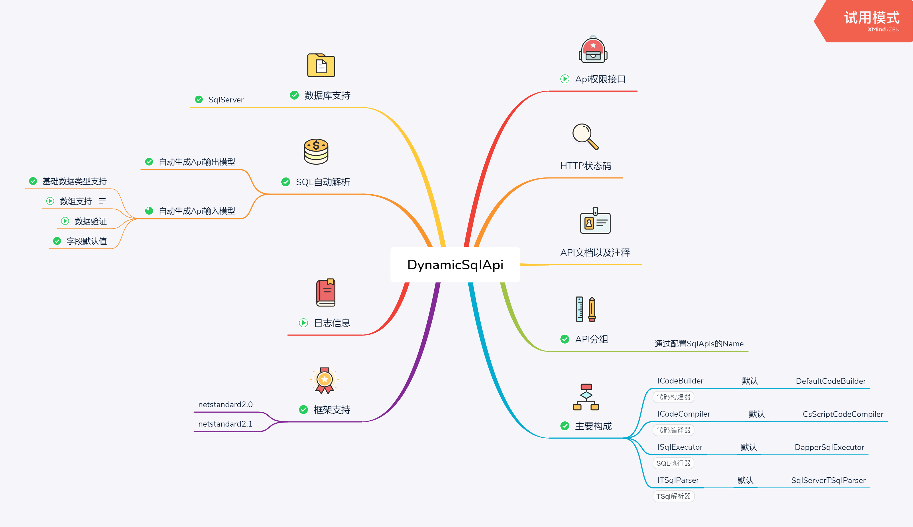
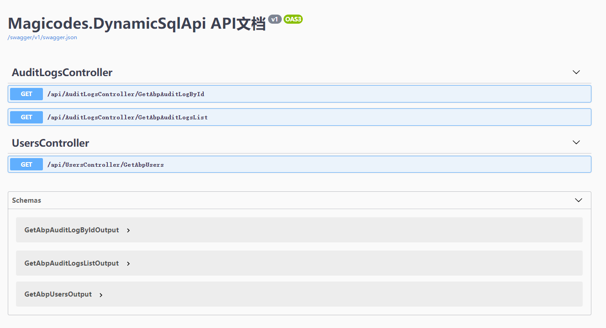

# Magicodes.DynamicSqlApi

根据SQL自动解析生成动态API。

[](https://dev.azure.com/xinlaiopencode/Magicodes.DynamicSqlApi/_build/latest?definitionId=9&branchName=master)

## 特点



### TODO

- [ ] 使用模板语法生成API控制器：[scriban/scriban](https://github.com/scriban/scriban)
- [x] API注释
- [ ] 基于数据表配置CURD
- [x] 多个数据库连接配置
- [x] 命名空间隔离（由于不支持命名空间定义，使用子类完成）
- [ ] 全局配置

### 配置

````xml
<?xml version="1.0" encoding="utf-8" ?>
<configuration>
  <SqlApis Name="AuditLogs">
    <SqlApi Name="GetAbpAuditLogsList" SqlTpl="SELECT TOP (@Count) *
        FROM [dbo].[AbpAuditLogs]">
      <Input>
        <!--会根据参数名称自动合并字段配置-->
        <Parameter Name="Count" DefaultValue="2"></Parameter>
      </Input>
    </SqlApi>
    <SqlApi Name="GetAbpAuditLogById">
      <SqlTpl>
        SELECT TOP 1 * FROM [dbo].[AbpAuditLogs]
        WHERE [Id] = @Id
      </SqlTpl>
    </SqlApi>
  </SqlApis>
  <SqlApis Name="Users">
    <SqlApi Name="GetAbpUsers">
      <SqlTpl>
        SELECT TOP (1000) *
        FROM [dbo].[AbpUsers]
      </SqlTpl>
    </SqlApi>
  </SqlApis>
</configuration>
````

### 结果



## 相关官方Nuget包

| 名称     |      Nuget      |
|----------|:-------------:|
| Magicodes.DynamicSqlApi.Core  |  [](https://www.nuget.org/packages/Magicodes.DynamicSqlApi.Core) |
| Magicodes.DynamicSqlApi.All |    [](https://www.nuget.org/packages/Magicodes.DynamicSqlApi.All)   |
| Magicodes.DynamicSqlApi.CsScript |    [](https://www.nuget.org/packages/Magicodes.DynamicSqlApi.CsScript)   |
| Magicodes.DynamicSqlApi.Dapper |    [](https://www.nuget.org/packages/Magicodes.DynamicSqlApi.Dapper)   |
| Magicodes.DynamicSqlApi.SqlServer |    [](https://www.nuget.org/packages/Magicodes.DynamicSqlApi.SqlServer)   |

## VNext

> 以下内容均已有思路，但是缺乏精力，因此虚席待PR，有兴趣的朋友可以参与进来，多多交流。

见上图：

- [x] API分组
- [ ] API权限控制
- [ ] API文档以及注释
- [ ] 导入导出
- [ ] HTTP状态码
- [ ] 日志
- [ ] 数据验证
- [ ] 数组支持


## 开始使用

1. 引用Nuget包"Magicodes.DynamicSqlApi.All"

| 名称     |      说明      |      Nuget      |
|----------|:-------------:|:-------------:|
| Magicodes.DynamicSqlApi.All  | Magicodes.DynamicSqlApi 默认实现|  [](https://www.nuget.org/packages/Magicodes.DynamicSqlApi.All) |

2. 添加配置文件“sqlMapper.xml”

配置文件默认为“sqlMapper.xml”，配置参考下文：
````xml
<?xml version="1.0" encoding="utf-8" ?>
<configuration>
  <SqlApis Name="AuditLogs">
    <SqlApi Name="GetAbpAuditLogsList" SqlTpl="SELECT TOP (@Count) *
        FROM [dbo].[AbpAuditLogs]">
      <Input>
        <!--会根据参数名称自动合并字段配置-->
        <Parameter Name="Count" DefaultValue="2"></Parameter>
      </Input>
    </SqlApi>
    <SqlApi Name="GetAbpAuditLogById">
      <SqlTpl>
        SELECT TOP 1 * FROM [dbo].[AbpAuditLogs]
        WHERE [Id] = @Id
      </SqlTpl>
    </SqlApi>
  </SqlApis>
  <SqlApis Name="Users">
    <SqlApi Name="GetAbpUsers">
      <SqlTpl>
        SELECT TOP (1000) *
        FROM [dbo].[AbpUsers]
      </SqlTpl>
    </SqlApi>
  </SqlApis>
</configuration>
````

如上述配置所示，仅需配置SQL语句即可，参数和结果列表全由Magicodes.DynamicSqlApi自动解析生成。Name是必须的。

3. 配置ASP.NET Core工程

添加配置：

````C#
    public class Program
    {
        public static void Main(string[] args)
        {
            CreateHostBuilder(args).Build().Run();
        }

        public static IHostBuilder CreateHostBuilder(string[] args) =>
            Host.CreateDefaultBuilder(args)
                .ConfigureAppConfiguration((hostingContext, config) =>
                {
                    var env = hostingContext.HostingEnvironment;
                    //根据环境变量加载不同的JSON配置
                    config.AddJsonFile("appsettings.json", true, true)
                        .AddJsonFile($"appsettings.{env.EnvironmentName}.json",
                            true, true);
                    //从环境变量添加配置
                    config.AddEnvironmentVariables();
                    config.AddXmlFile("sqlMapper.xml", true, false);
                })
                .ConfigureWebHostDefaults(webBuilder =>
                {
                    webBuilder.UseStartup<Startup>();
                });
    }
````

启用DynamicSqlApi：

````C#
        public void ConfigureServices(IServiceCollection services)
        {
            services.AddAllDynamicSqlApi(Configuration["ConnectionStrings:Default"]);
        }

        public void Configure(IApplicationBuilder app, IWebHostEnvironment env)
        {
            app.UseDynamicSqlApi();
        }
````

## 联系我们

> ### 订阅号

关注“麦扣聊技术”订阅号可以获得最新文章、教程、文档：


> ### QQ群

- 编程交流群<85318032>

- 产品交流群<897857351>

> ### 文档官网&官方博客

- 文档官网：<https://docs.xin-lai.com/>
- 博客：<http://www.cnblogs.com/codelove/>


> ### 其他开源库

- <https://github.com/xin-lai>
- <https://gitee.com/magicodes>

